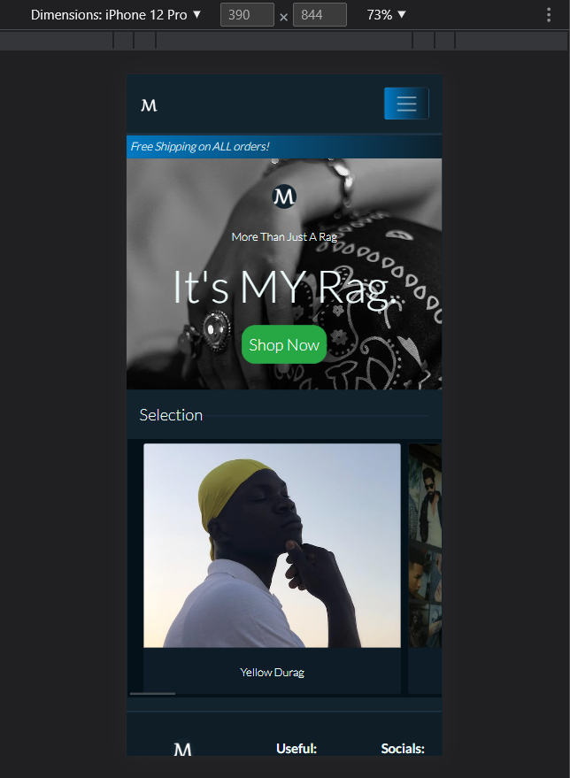

# Testing

To return to readme documentation please click here [README.md](README.md)

## Manual Testing

### User Story Testing

#### View & Navigation

##### Owner
- As an owner I so that I can
##### User
- As an user I so that I can

#### Registration & User Accounts

##### Owner
- As an owner I so that I can
##### User
- As an user I so that I can

#### Customisation

##### Owner
- As an owner I so that I can
##### User
- As an user I so that I can

#### Purchasing & Checkout

##### Owner
- As an owner I so that I can
##### User
- As an user I so that I can

## Code Validation

### HTML

I checked all my templates for html errors using [Nu Html Checker](https://validator.w3.org/). These are the page errors before I proceeded to fix them.

#### Homepage

#### Contact

#### Newsletter

#### All Durags

#### Durag Details

#### Edit Durag

#### Create Durag

#### Basket

#### Checkout

#### Checkout Success

#### Profile

#### Register

#### Login

#### Logout

### CSS 

[Jigsaw](https://jigsaw.w3.org/)

I copied and pasted my css into the input section and checked my css. Everything seems to be in order with nothing wrong.

#### Base

#### Checkout

#### Home

#### Products

#### Profiles

### Python

[PEP8](http://pep8online.com/)

My code was copied and pasted into the pep8 checker to see if all of my code was pep8 complient. I had a few files which exceeded the length required but it was a quick fix. I also used the problems tab in the gitpod ide.

## Browser Compatibility

I have navigated through the site using three main internet browsers, chrome, firefox and edge. I am yes to come across any compatibility issues.

### Chrome

### Firefox 

### Edge

## Browser Responsiveness

I used chrome developer settings to test the responsiveness of the site on 3 devices with varying sizes. Iphone 5, the Iphone 12 Pro and the Ipad Air.

### Iphone 5SE

### Iphone 12

### Ipad Air

## Lighthouse

I used the Lighthouse automated tool from Developer Tools to perform site quality tests. The result is shown below.

#### Homepage

#### Contact

#### Newsletter

#### All Durags

#### Durag Details

#### Edit Durag

#### Create Durag

#### Basket

#### Checkout

#### Checkout Success

#### Profile

#### Register

#### Login

#### Logout

## Bugs

### Fixed Bug

- Users were able to access parts of the site by using the url or back button when logged out.
- Users were redirected to missing success page after login.
- Placeholder image link was broken for durags with no image url.

### Unfixed Bug

